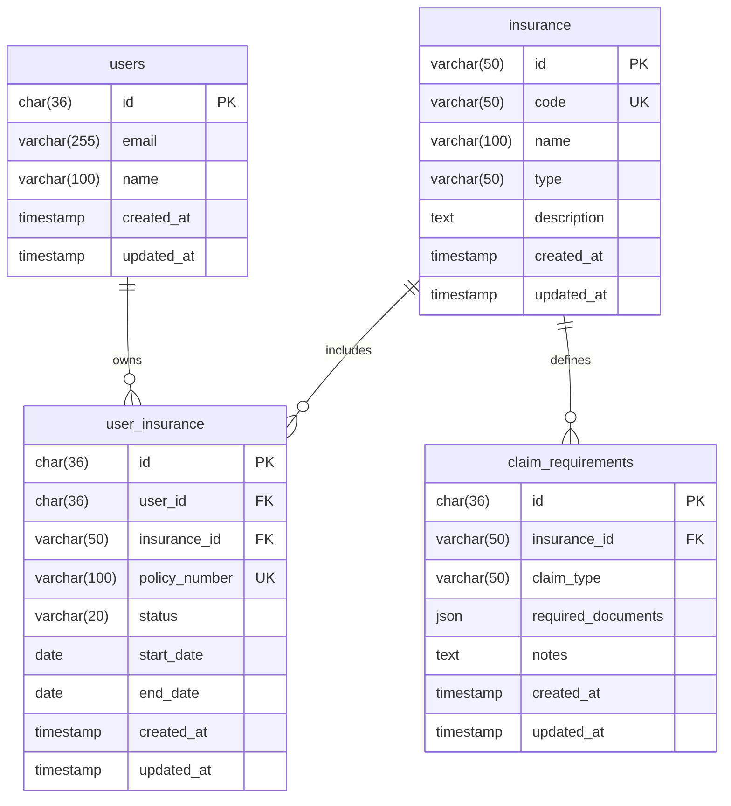

# 🛡️ 保險智慧助理 (Insurance Assistance)

基於 **Vue 3** (Web Server)、**TypeScript 三層式架構** (AP Server)、**MySQL 8.0+** 與意圖辨識 AI (Intent Classification AI) 的智慧保險助理系統。系統透過自然語言理解使用者需求，結合身分驗證與業務服務，提供即時保單查詢、理賠文件指引與線上理賠流程導引，前後端各自獨立容器化部署於 **GCP Cloud Run**。

---

## 📑 目錄

- [專案簡介](#-專案簡介)
- [核心功能 (v1)](#-核心功能-v1)
- [系統架構與技術棧](#-系統架構與技術棧)
  - [前後端與部署拓撲](#前後端與部署拓撲)
  - [後端三層式架構](#後端三層式架構)
- [API 設計與工作流程](#-api-設計與工作流程)
  - [1. 查詢使用者保單 (list_user_policies)](#1-查詢使用者保單-list_user_policies)
  - [2. 查詢理賠所需文件 (claim_required_documents)](#2-查詢理賠所需文件-claim_required_documents)
  - [3. 導引理賠申請 (start_claim)](#3-導引理賠申請-start_claim)
- [資料庫實體模型與版控 (MySQL)](#-資料庫實體模型與版控-mysql)
- [專案目錄結構](#-專案目錄結構)
- [快速開始](#-快速開始)
- [相關規格與開發準則文件](#-相關規格與開發準則文件)

---

## 💡 專案簡介

傳統保險服務常因保單條款繁複、理賠流程冗長而造成保戶困擾。「保險智慧助理」旨在提供直覺、安全且結構化的交談式體驗：

- **意圖分類**：精準理解使用者自然語言提問（例如「我目前有幾張保單？」、「住院需要準備什麼？」）。
- **安全驗證**：透過 [Better Auth](https://better-auth.com/) 進行 Session 授權驗證，確保個人保單資料不外洩。
- **模板化回應**：AI 僅負責意圖判定與參數解析，資料查詢與回答皆經由業務層 (Service Layer) 與回應模板 (Response Template) 輸出，確保金融資訊精確無誤。
- **動態行為導航**：支援 Action Response，後端可指揮前端 Router 自動導航至理賠申請頁面。
- **雲原生雙服務架構**：前端（Web Server）與後端（AP Server）完全解耦，各自作為獨立微服務部署於 GCP Cloud Run，彈性自動伸縮。

---

## 🚀 核心功能 (v1)

| 意圖名稱 (Intent)          | 觸發範例                                               | 說明                                                                   |
| :------------------------- | :----------------------------------------------------- | :--------------------------------------------------------------------- |
| `list_user_policies`       | 「我目前有幾張保單？」、「查看我的保險」               | 查詢當前登入使用者的所有有效保單狀態與明細。                           |
| `claim_required_documents` | 「住院理賠需要準備什麼文件？」、「車禍理賠要帶什麼？」 | 根據使用者持有的保單類型與出險情境，列出需檢附的理賠文件清單。         |
| `start_claim`              | 「我要申請理賠」、「幫我申請理賠」                     | 檢查使用者名下可申請之保單，回傳導航 Action 引導進入線上理賠申請表單。 |

---

## 🏗️ 系統架構與技術棧

### 前後端與部署拓撲

前後端完全分離，各自獨立打包容器鏡像並部署至 **GCP Cloud Run**：

```
                              使用者瀏覽器 (Client)
                                       │
            ┌──────────────────────────┴──────────────────────────┐
            │ HTTPS (靜態資源與 SPA 頁面)                          │ HTTPS (RESTful API)
            ▼                                                     ▼
┌──────────────────────────────┐              ┌──────────────────────────────┐
│  Web Server (Frontend)       │              │  AP Server (Backend)         │
│  - Vue 3 + Vite + TypeScript │              │  - Node.js + TypeScript      │
│  - Nginx Alpine Container    │              │  - 三層式架構 (Controller/   │
│  - GCP Cloud Run (Service 1) │              │    Service/Repository)       │
└──────────────────────────────┘              │  - GCP Cloud Run (Service 2) │
                                              └──────────────┬───────────────┘
                                                             │
                                     ┌───────────────────────┼───────────────────────┐
                                     │ Unix Socket / Proxy   │ API Key               │ Secret
                                     ▼                       ▼                       ▼
                         ┌───────────────────────┐ ┌──────────────────┐ ┌──────────────────┐
                         │ GCP Cloud SQL (MySQL) │ │ Intent AI (LLM)  │ │  Secret Manager  │
                         └───────────────────────┘ └──────────────────┘ └──────────────────┘
```

- **Frontend (Web Server)**：Vue 3 + Vite + Pinia + Vue Router + TypeScript，以 Nginx 容器託管並部署於 GCP Cloud Run。
- **Backend (AP Server)**：Node.js + TypeScript，採用嚴格三層式架構，套件管理統一使用 **pnpm**。
- **Database**：MySQL 8.0+（託管於 GCP Cloud SQL），所有 DDL/DML 版本控制皆收錄於專案 `db/` 目錄。
- **Authentication**：Better Auth，處理 Session 驗證並取得 `userId`。
- **AI Engine**：Intent Classification AI，負責理解使用者對話並分類意圖。
- **Deployment & Cloud**：GCP Cloud Run + GCP Cloud SQL (MySQL) + GCP Secret Manager。

### 後端三層式架構

後端 AP Server 嚴格遵守 Controller - Service - Repository 分層規範：

```
┌──────────────────────────────────────────────────────────────┐
│               1. 表現層 (Controller Layer)                   │
│   - AssistantController / PolicyController / ClaimController │
│   - 職責：HTTP 路由、Input Schema 驗證、Better Auth Session  │
└──────────────────────────────┬───────────────────────────────┘
                               │ 調用 Service (DTO / Context)
┌──────────────────────────────▼───────────────────────────────┐
│               2. 商業邏輯層 (Service Layer)                  │
│   - UserPolicyService / ClaimService / IntentRouter          │
│   - 職責：商業規則計算、AI 意圖調度、事務管理、模板渲染       │
└──────────────────────────────┬───────────────────────────────┘
                               │ 調用 Repository (參數化查詢)
┌──────────────────────────────▼───────────────────────────────┐
│               3. 資料存取層 (Repository Layer)               │
│   - UserInsuranceRepository / ClaimRequirementRepository     │
│   - 職責：MySQL 8.0 SQL 查詢、資料庫連線池、Entity 映射      │
└──────────────────────────────┬───────────────────────────────┘
                               │ SQL (InnoDB / utf8mb4)
┌──────────────────────────────▼───────────────────────────────┐
│                     Database (MySQL 8.0+)                    │
└──────────────────────────────────────────────────────────────┘
```

---

## 📡 API 設計與工作流程

詳細時序圖請參閱 [spec/APIDesign/v1.md](spec/APIDesign/v1.md)。

### 對話主入口 (Assistant Endpoint)

```http
POST /assistant/message
```

**Request Payload:**

```json
{
  "message": "我目前有幾張保單？"
}
```

後端處理流程：

1. 經由 Better Auth 驗證使用者 Session，取出 `userId`。
2. 將訊息傳入 **Intent Classification AI** 判定意圖。
3. **Intent Router** 根據意圖分流呼叫對應內部服務（Controller ➔ Service ➔ Repository）。

---

### 1. 查詢使用者保單 (`list_user_policies`)

- **內部路由**：`GET /users/me/policies`
- **業務元件**：`PolicyController` ➔ `UserPolicyService` ➔ `UserInsuranceRepository`
- **資料查詢**：查詢 `user_insurance JOIN insurance` (MySQL)
- **回覆方式**：套用保單查詢模板 (Policy Template)
- **Response 範例**：
  ```json
  {
    "success": true,
    "data": {
      "type": "text",
      "intent": "list_user_policies",
      "content": "您目前共有 3 張有效保單：\n1. 安心終身壽險 (有效)\n2. 守護醫療健康保險 (有效)\n3. 意外傷害保障 (有效)",
      "data": {
        "totalPolicies": 3,
        "policies": [
          { "id": "POL-001", "name": "安心終身壽險", "status": "ACTIVE" },
          { "id": "POL-002", "name": "守護醫療健康保險", "status": "ACTIVE" },
          { "id": "POL-003", "name": "意外傷害保障", "status": "ACTIVE" }
        ]
      }
    }
  }
  ```

---

### 2. 查詢理賠所需文件 (`claim_required_documents`)

- **內部路由**：`GET /claims/requirements?type={claimType}`
- **業務元件**：`ClaimController` ➔ `ClaimService` ➔ `UserInsuranceRepository` & `ClaimRequirementRepository`
- **資料查詢**：比對使用者有效保單與 `claim_requirements` 資料表
- **回覆方式**：套用理賠文件模板 (Claim Requirement Template)
- **Response 範例**：
  ```json
  {
    "success": true,
    "data": {
      "type": "text",
      "intent": "claim_required_documents",
      "content": "為您查詢住院理賠所需準備文件清單如下：\n- 醫療診斷證明書（正本）\n- 醫療費用收據與明細表\n- 保險理賠申請書\n- 被保險人身分證明文件與存摺封面影本",
      "data": {
        "claimType": "hospitalization",
        "requiredDocuments": [
          { "name": "醫療診斷證明書", "isOriginalRequired": true },
          { "name": "醫療費用收據與明細表", "isOriginalRequired": true },
          { "name": "保險理賠申請書", "isOriginalRequired": false },
          { "name": "身分證正反面影本及存摺封面", "isOriginalRequired": false }
        ]
      }
    }
  }
  ```

---

### 3. 導引理賠申請 (`start_claim`)

- **內部路由**：`POST /claims/start`
- **業務元件**：`ClaimController` ➔ `ClaimService` ➔ `UserInsuranceRepository`
- **資料查詢**：查詢使用者名下可申請理賠之保單清單
- **回覆方式**：套用動作模板 (Action Template)，回傳帶有前端路由導向的指令
- **Response 範例**：
  ```json
  {
    "success": true,
    "data": {
      "type": "action",
      "intent": "start_claim",
      "action": "NAVIGATE",
      "payload": {
        "route": "/claims/apply",
        "params": {
          "availablePolicyIds": ["POL-001", "POL-002"]
        }
      },
      "message": "已為您準備好理賠申請流程，即將開啟申請頁面..."
    }
  }
  ```
- **前端行為**：前端 Vue 應用監聽到 `NAVIGATE` Action 後，調用 Vue Router 自動導航至 `/claims/apply`。

---

## 🗄️ 資料庫實體模型與版控 (MySQL)

系統核心使用 MySQL 8.0+ (InnoDB)，所有 DDL 與 DML 腳本皆在 `db/` 目錄下進行嚴格版本控制：



- 結構定義 (DDL)：收錄於 `db/ddl/`（如 `V001__create_initial_schema.sql`）
- 種子資料 (DML)：收錄於 `db/dml/`（如 `V001__seed_initial_data.sql`）
- 執行說明請參閱 [db/README.md](db/README.md)。

---

## 📂 專案目錄結構

```
insuranceAssistance/
├── backend/                  # 後端 AP Server (Node.js / TypeScript)
│   ├── src/
│   │   ├── config/           # 環境變數與 MySQL 連線池設定
│   │   ├── controllers/      # 表現層 Controller (assistant, policy, claims)
│   │   ├── services/         # 商業邏輯層 Service (UserPolicyService, ClaimService)
│   │   ├── repositories/     # 資料存取層 Repository (MySQL 查詢)
│   │   ├── templates/        # 回應與動作模板 (Response & Action Templates)
│   │   ├── ai/               # 意圖分類器與路由器 (Intent Classifier & Router)
│   │   ├── middlewares/      # 認證 (Better Auth)、驗證與錯誤處理中介層
│   │   └── models/           # DTO 與 Entity 型別定義
│   ├── Dockerfile            # AP Server Multi-stage Dockerfile
│   ├── package.json
│   ├── pnpm-lock.yaml        # pnpm 依賴鎖定檔
│   └── tsconfig.json
├── frontend/                 # 前端 Web Server (Vue 3 / Vite)
│   ├── src/
│   │   ├── components/       # 對話介面與卡片元件
│   │   ├── views/            # SPA 頁面 (助理對話、理賠申請)
│   │   ├── composables/      # 對話與狀態組合邏輯
│   │   ├── stores/           # Pinia 狀態管理
│   │   ├── router/           # Vue Router 配置 (NAVIGATE Action 接收端)
│   │   └── services/         # AP Server API 客戶端
│   ├── nginx.conf            # Web Server 容器 Nginx 設定 (SPA fallback)
│   ├── Dockerfile            # Web Server Multi-stage Dockerfile
│   ├── package.json
│   ├── pnpm-lock.yaml        # pnpm 依賴鎖定檔
│   └── vite.config.ts
├── db/                       # 資料庫版本控制
│   ├── ddl/                  # Schema 定義腳本 (V001__create_initial_schema.sql)
│   ├── dml/                  # 種子資料腳本 (V001__seed_initial_data.sql)
│   └── README.md             # 資料庫初始化指南
├── spec/                     # 設計規格與開發準則
│   ├── devPrincipal/         # 團隊開發準則庫
│   │   ├── README.md         # 開發準則總覽
│   │   ├── 01-architecture.md# 系統與三層式架構規範
│   │   ├── 02-backend.md     # 後端規範 (TypeScript & pnpm)
│   │   ├── 03-frontend.md    # 前端規範 (Vue 3)
│   │   ├── 04-database.md    # 資料庫設計與版控規範 (MySQL)
│   │   └── 05-deployment.md  # 容器化與 GCP Cloud Run 部署規範
│   └── APIDesign/
│       └── v1.md             # v1 API 時序圖規格
└── README.md                 # 專案總覽文件
```

---

## 🛠️ 快速開始

### 環境需求

- **Node.js** >= 20.10.0 LTS
- **pnpm** >= 9.x（`corepack enable && corepack prepare pnpm@latest --activate`）
- **MySQL** >= 8.0（或 Docker）

### 1. 啟動本機 MySQL 資料庫

```bash
docker run --name insurance-mysql \
  -e MYSQL_ROOT_PASSWORD=rootsecret \
  -e MYSQL_DATABASE=insurance_db \
  -e MYSQL_USER=app_backend \
  -e MYSQL_PASSWORD=app_secret \
  -p 3306:3306 \
  -d mysql:8.0 \
  --character-set-server=utf8mb4 \
  --collation-server=utf8mb4_unicode_ci

# 匯入 DDL 與 DML
mysql -h 127.0.0.1 -P 3306 -u app_backend -papp_secret insurance_db < db/ddl/V001__create_initial_schema.sql
mysql -h 127.0.0.1 -P 3306 -u app_backend -papp_secret insurance_db < db/dml/V001__seed_initial_data.sql
```

### 2. 啟動後端 AP Server

```bash
cd backend
pnpm install
pnpm dev
```

後端環境變數設定檔 (`backend/.env`)：

```env
PORT=8080
DB_HOST=127.0.0.1
DB_PORT=3306
DB_USER=app_backend
DB_PASSWORD=app_secret
DB_NAME=insurance_db
BETTER_AUTH_SECRET="your-better-auth-secret"
BETTER_AUTH_URL="http://localhost:8080"
AI_API_KEY="your-llm-api-key"
```

### 3. 啟動前端 Web Server

```bash
cd frontend
pnpm install
pnpm dev
```

前端環境變數設定檔 (`frontend/.env`)：

```env
VITE_API_BASE_URL="http://localhost:8080"
```

---

## 📖 相關規格與開發準則文件

- **開發準則 (spec/devPrincipal)**：
  - [開發準則總覽](spec/devPrincipal/README.md)
  - [01. 系統架構與三層式設計準則](spec/devPrincipal/01-architecture.md)
  - [02. 後端開發規範 (TypeScript & pnpm)](spec/devPrincipal/02-backend.md)
  - [03. 前端開發規範 (Vue 3)](spec/devPrincipal/03-frontend.md)
  - [04. 資料庫設計與版控規範 (MySQL & db/)](spec/devPrincipal/04-database.md)
  - [05. 容器化與 GCP Cloud Run 部署規範](spec/devPrincipal/05-deployment.md)
- **資料庫管理 (db)**：
  - [資料庫結構與種子資料指南](db/README.md)
- **API 設計規格**：
  - [API 設計規格 (v1)](spec/APIDesign/v1.md)
