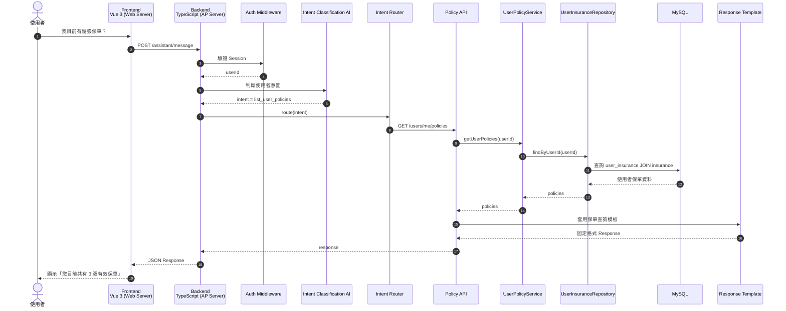
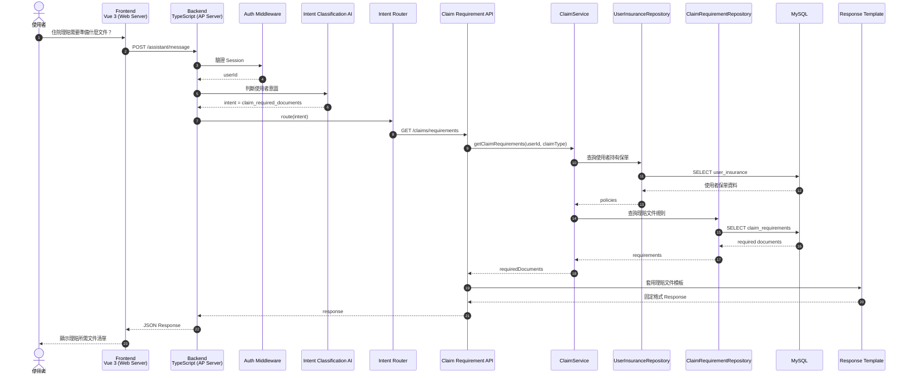
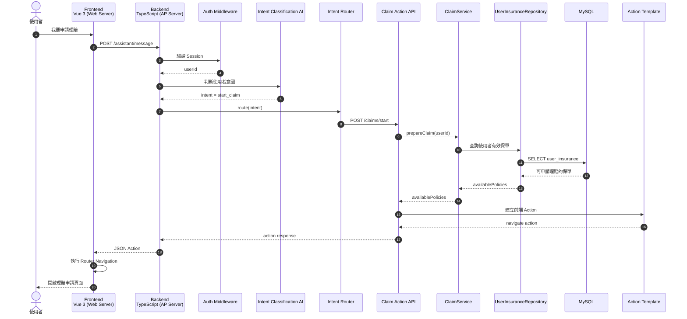

## API design

### 查詢使用者保單 list_user_policies

```mermaid
sequenceDiagram
    autonumber

    actor User as 使用者
    participant FE as Frontend<br/>Vue 3 (Web Server)
    participant BE as Backend<br/>TypeScript (AP Server)
    participant Auth as Auth Middleware
    participant IntentAI as Intent Classification AI
    participant Router as Intent Router
    participant PolicyAPI as Policy API
    participant Service as UserPolicyService
    participant Repo as UserInsuranceRepository
    participant DB as MySQL
    participant Template as Response Template

    User->>FE: 我目前有幾張保單？
    FE->>BE: POST /assistant/message

    BE->>Auth: 驗證 Session
    Auth-->>BE: userId

    BE->>IntentAI: 判斷使用者意圖
    IntentAI-->>BE: intent = list_user_policies

    BE->>Router: route(intent)
    Router->>PolicyAPI: GET /users/me/policies

    PolicyAPI->>Service: getUserPolicies(userId)
    Service->>Repo: findByUserId(userId)

    Repo->>DB: 查詢 user_insurance JOIN insurance
    DB-->>Repo: 使用者保單資料

    Repo-->>Service: policies
    Service-->>PolicyAPI: policies

    PolicyAPI->>Template: 套用保單查詢模板
    Template-->>PolicyAPI: 固定格式 Response

    PolicyAPI-->>BE: response
    BE-->>FE: JSON Response
    FE-->>User: 顯示「您目前共有 3 張有效保單」
```

### 查詢理賠所需文件 claim_required_documents

```mermaid
sequenceDiagram
    autonumber

    actor User as 使用者
    participant FE as Frontend<br/>Vue 3 (Web Server)
    participant BE as Backend<br/>TypeScript (AP Server)
    participant Auth as Auth Middleware
    participant IntentAI as Intent Classification AI
    participant Router as Intent Router
    participant ClaimAPI as Claim Requirement API
    participant Service as ClaimService
    participant PolicyRepo as UserInsuranceRepository
    participant ClaimRepo as ClaimRequirementRepository
    participant DB as MySQL
    participant Template as Response Template

    User->>FE: 住院理賠需要準備什麼文件？
    FE->>BE: POST /assistant/message

    BE->>Auth: 驗證 Session
    Auth-->>BE: userId

    BE->>IntentAI: 判斷使用者意圖
    IntentAI-->>BE: intent = claim_required_documents

    BE->>Router: route(intent)

    Router->>ClaimAPI: GET /claims/requirements

    ClaimAPI->>Service: getClaimRequirements(userId, claimType)

    Service->>PolicyRepo: 查詢使用者持有保單
    PolicyRepo->>DB: SELECT user_insurance
    DB-->>PolicyRepo: 使用者保單資料
    PolicyRepo-->>Service: policies

    Service->>ClaimRepo: 查詢理賠文件規則
    ClaimRepo->>DB: SELECT claim_requirements
    DB-->>ClaimRepo: required documents
    ClaimRepo-->>Service: requirements

    Service-->>ClaimAPI: requiredDocuments

    ClaimAPI->>Template: 套用理賠文件模板
    Template-->>ClaimAPI: 固定格式 Response

    ClaimAPI-->>BE: response
    BE-->>FE: JSON Response

    FE-->>User: 顯示理賠所需文件清單
```

### 導引理賠申請 start_claim

```mermaid
sequenceDiagram
    autonumber

    actor User as 使用者
    participant FE as Frontend<br/>Vue 3 (Web Server)
    participant BE as Backend<br/>TypeScript (AP Server)
    participant Auth as Auth Middleware
    participant IntentAI as Intent Classification AI
    participant Router as Intent Router
    participant ClaimAPI as Claim Action API
    participant Service as ClaimService
    participant Repo as UserInsuranceRepository
    participant DB as MySQL
    participant Template as Action Template

    User->>FE: 我要申請理賠
    FE->>BE: POST /assistant/message

    BE->>Auth: 驗證 Session
    Auth-->>BE: userId

    BE->>IntentAI: 判斷使用者意圖
    IntentAI-->>BE: intent = start_claim

    BE->>Router: route(intent)

    Router->>ClaimAPI: POST /claims/start

    ClaimAPI->>Service: prepareClaim(userId)

    Service->>Repo: 查詢使用者有效保單
    Repo->>DB: SELECT user_insurance
    DB-->>Repo: 可申請理賠的保單
    Repo-->>Service: availablePolicies

    Service-->>ClaimAPI: availablePolicies

    ClaimAPI->>Template: 建立前端 Action
    Template-->>ClaimAPI: navigate action

    ClaimAPI-->>BE: action response
    BE-->>FE: JSON Action

    FE->>FE: 執行 Router Navigation
    FE-->>User: 開啟理賠申請頁面
```
