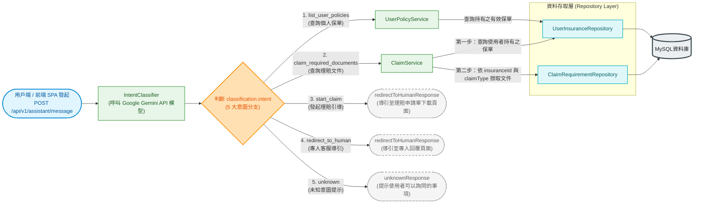

# 後端 POST /assistant/message 流向資料庫流程圖 (Backend Flowchart)

本文件描述 **`POST /api/v1/assistant/message`** 請求自發起到進入資料庫的完整生命週期。涵蓋中介軟體、身份認證、控制器、AI 意圖識別分析，展開 **5 大意圖分支（All Intents）**，並展示如何透過 Repository 與 Drizzle ORM 最終打入資料庫（MySQL 8.0）終點。

---

## 1. 核心流程圖 (Mermaid Flowchart)

---

## 2. 5 大意圖分支與資料庫互動說明

|   #   | 意圖名稱 (Intent)          | 意圖業務涵義     | 後續調用 Service 與 Repository                                                                                                                    | 涉及之資料表 (Tables)                                     | 是否存取 DB |
| :---: | :------------------------- | :--------------- | :------------------------------------------------------------------------------------------------------------------------------------------------ | :-------------------------------------------------------- | :---------: |
| **1** | `list_user_policies`       | 查詢個人有效保單 | `UserPolicyService.getUserPolicies` ➔ `UserInsuranceRepository.findActiveByUserId`                                                                | `user_insurance` `insurance` (INNER JOIN)             |   **是**    |
| **2** | `claim_required_documents` | 查詢理賠必備文件 | `ClaimService.getClaimRequirements` ➔ 先由 `UserInsuranceRepository` 查保單 ➔ 再由 `ClaimRequirementRepository.findByInsuranceAndType` 查文件清單 | `user_insurance` `insurance` `claim_requirements` |   **是**    |
| **3** | `start_claim`              | 發起理賠引導流程 | `ClaimService.prepareClaim` ➔ `UserInsuranceRepository.findActiveByUserId` 檢驗有效保單                                                           | `user_insurance` `insurance`                          |   **是**    |
| **4** | `redirect_to_human`        | 轉接專人客服     | `IntentRouter.redirectToHumanResponse` 直接回傳文字                                                                                               | 無                                                        |   **否**    |
| **5** | `unknown`                  | 未知意圖提示     | `IntentRouter.unknownResponse` 直接回傳引導問句                                                                                                   | 無                                                        |   **否**    |

---

## 3. 各階段核心代碼映射

1. **入口路由與中介層**：
   - 路由：[`backend/src/routes/assistant.routes.ts`](file:///home/woody/small_projects/insuranceAssistance/backend/src/routes/assistant.routes.ts)
   - 認證中介層：[`backend/src/middlewares/auth.middleware.ts`](file:///home/woody/small_projects/insuranceAssistance/backend/src/middlewares/auth.middleware.ts)
2. **控制器層**：
   - 控制器：[`backend/src/controllers/assistant.controller.ts`](file:///home/woody/small_projects/insuranceAssistance/backend/src/controllers/assistant.controller.ts)
3. **AI 意圖識別與路由**：
   - 意圖識別器：[`backend/src/ai/intent-classifier.ts`](file:///home/woody/small_projects/insuranceAssistance/backend/src/ai/intent-classifier.ts)
   - 意圖路由器：[`backend/src/ai/intent-router.ts`](file:///home/woody/small_projects/insuranceAssistance/backend/src/ai/intent-router.ts)
4. **商業邏輯層**：
   - 保單服務：[`backend/src/services/user-policy.service.ts`](file:///home/woody/small_projects/insuranceAssistance/backend/src/services/user-policy.service.ts)
   - 理賠服務：[`backend/src/services/claim.service.ts`](file:///home/woody/small_projects/insuranceAssistance/backend/src/services/claim.service.ts)
5. **資料存取層 (Drizzle ORM ➔ 連線池 ➔ MySQL)**：
   - 保單存取：[`backend/src/repositories/user-insurance.repository.ts`](file:///home/woody/small_projects/insuranceAssistance/backend/src/repositories/user-insurance.repository.ts)
   - 理賠文件存取：[`backend/src/repositories/claim-requirement.repository.ts`](file:///home/woody/small_projects/insuranceAssistance/backend/src/repositories/claim-requirement.repository.ts)
   - 資料庫連線池：[`backend/src/db/index.ts`](file:///home/woody/small_projects/insuranceAssistance/backend/src/db/index.ts)
