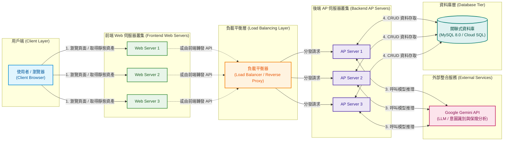

# 系統架構圖 (System Architecture)

本文件描述「保險智慧助理」系統的整體實體部署架構，涵蓋前端 Web Server 叢集、負載平衡器（Load Balancer）、後端 AP Server 叢集、外部 Gemini API 服務以及資料庫層。

---

## 1. 系統架構圖 (Mermaid Diagram)

---

## 2. 架構元件說明

| 層級         | 元件名稱          | 數量 | 說明與職責                                                                                                                      |
| :----------- | :---------------- | :--: | :------------------------------------------------------------------------------------------------------------------------------ |
| **用戶端**   | Client Browser    |  -   | 使用者裝置與瀏覽器，發起網頁瀏覽與智慧助理對話互動。                                                                            |
| **前端叢集** | Web Server 1 ~ 3  |  3   | 提供前端 SPA（Vue 3 + Vite）靜態資源託管與 Nginx 服務，確保高併發靜態下載能力與容錯能力。                                       |
| **負載平衡** | Load Balancer     |  1   | 接收來自用戶端/前端的 API 請求，依據負載演算法（如輪詢 Round-Robin、最少連線 Least Connection）將流量平均分發至後端 AP Server。 |
| **後端叢集** | AP Server 1 ~ 3   |  3   | Node.js / TypeScript 後端核心，負責身分驗證、控制器業務流程（三層式架構）、保險規則計算及會話管理。                             |
| **外部服務** | Google Gemini API |  1   | 外部大語言模型服務，負責自然語言理解、意圖辨識（Intent Classification）、理賠指引分析與動態回答生成。                           |
| **資料庫層** | MySQL / Cloud SQL |  1   | 核心關聯式資料庫，儲存保戶資料、保單資訊、理賠規則、對話記錄與系統設定等數據。                                                  |

---

## 3. 資料與請求處理流程

1. **靜態資源讀取**：
   - 使用者透過瀏覽器請求網頁時，由 3 台 Web Server 平行分擔靜態檔案（HTML / JS / CSS / Assets）的傳輸。
2. **API 請求轉發**：
   - 使用者在前端發起對話或業務查詢時，API 請求送至負載平衡器（Load Balancer），並由負載平衡器智慧調度給健康狀態良好的 AP Server（AP 1、AP 2 或 AP 3）。
3. **AI 模型呼叫**：
   - 接收到對話的 AP Server 整理 Context 與 Prompt 後，呼叫外部 **Google Gemini API** 進行意圖分析與對話推論。
4. **資料庫讀寫**：
   - AP Server 透過 Repository 層連線至資料庫（MySQL / Cloud SQL），進行保單查詢、理賠進度更新或對話歷程儲存。
