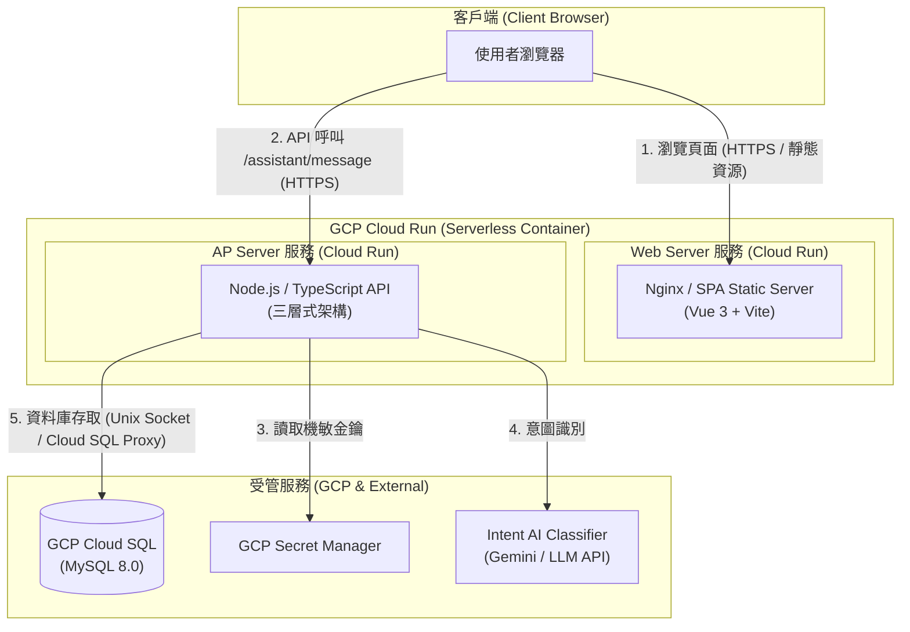
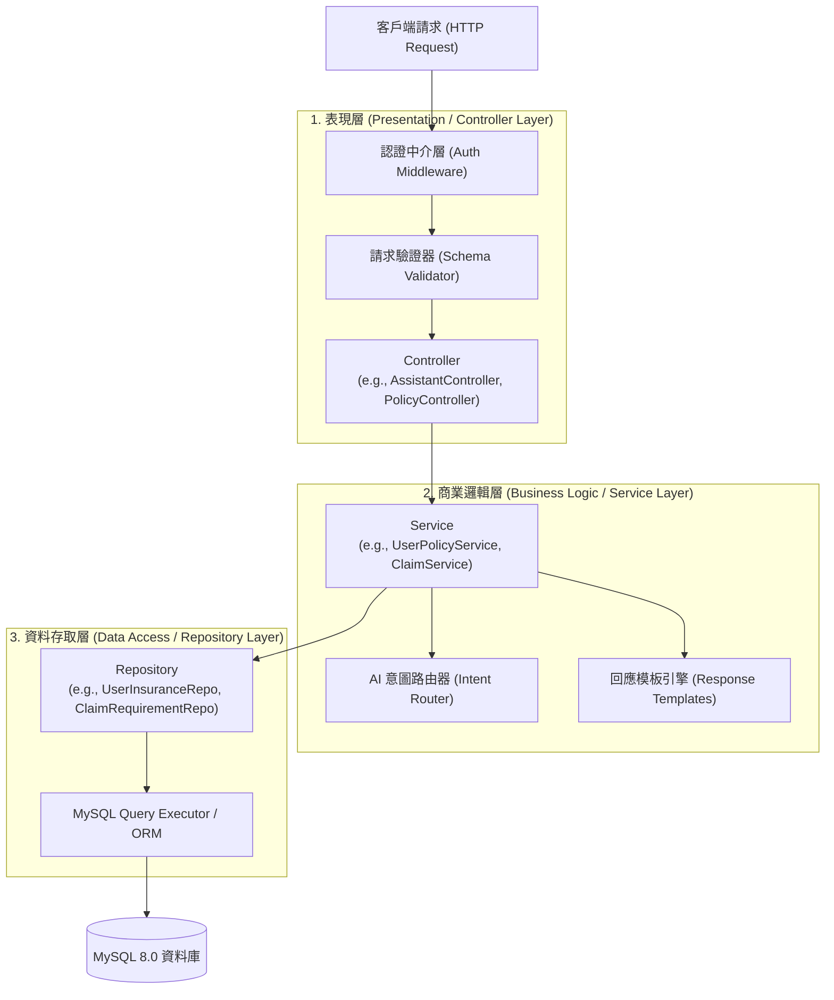

# 🏛️ 01 - 系統架構與三層式設計準則

本文件定義「保險智慧助理」系統的總體實體部署架構（Web Server 與 AP Server 分離）以及後端應用程式的三層式架構（Controller - Service - Repository）設計標準。

---

## 1. 總體系統架構 (System Architecture)

系統採用前後端完全分離（Decoupled Frontend & Backend）架構，各自封裝為獨立容器鏡像，獨立部署於 GCP Cloud Run 上。

### 1.1 Web Server (前端)

- **職責**：提供 Vue 3 SPA 靜態資產服務、HTML 靜態託管、前端路由轉發（處理 Client-side routing，所有未知路由倒回 `index.html`）。
- **特點**：輕量無狀態、不含業務機密邏輯，API 請求直接打往 AP Server。

### 1.2 AP Server (後端)

- **職責**：提供 RESTful API 端點、使用者認證與授權、意圖分析與流程編排、資料庫操作與商務邏輯。
- **特點**：純無狀態 (Stateless)，水平擴展安全，資料庫連線由 Cloud SQL Auth Proxy 或連線池受控管理。

---

## 2. 後端三層式架構 (Three-Tier Architecture)

後端業務系統嚴格遵守 **三層式架構 (Controller - Service - Repository)**，各層級擁有單一職責 (Single Responsibility Principle)，維持高內聚、低耦合。

---

## 3. 各層級職責與規範細則

### 3.1 表現層：Controller Layer

_檔案路徑位置：`backend/src/controllers/`_

- **核心責任**：
  1. 接收與解析 HTTP Request（URL 參數、Query String、Request Body）。
  2. 呼叫驗證模組（如 Zod / Joi）進行 Input Schema 驗證，攔截非法參數。
  3. 讀取中介軟體附加的授權上下文（例如從認證中介層取得 `userId`、角色）。
  4. 調用對應的 Service 方法，不介入任何業務計算或資料組合。
  5. 將 Service 回傳的領域資料打包為統一格式的 HTTP JSON Response（指定 HTTP 狀態碼）。
- **嚴格禁令**：
  - ❌ **絕對禁止** 在 Controller 撰寫 SQL 查詢或直接呼叫 Repository。
  - ❌ **絕對禁止** 在 Controller 撰寫業務計算（例如保單到期天數計算、理賠合格判斷）。
  - ❌ **絕對禁止** 在 Controller 直接調用外部 AI 模型。

### 3.2 商業邏輯層：Service Layer

_檔案路徑位置：`backend/src/services/`_

- **核心責任**：
  1. 系統商業規則核心，實現所有業務運算與流程決策。
  2. 跨多個 Repository 資料的整合、計算與資料流編排。
  3. 資料庫事務（Transaction）管理發起處（跨表的 ACID 交易）。
  4. 調度意圖辨識模組（Intent AI）與格式化回應模板（Response Template / Action Template）。
  5. 拋出語意明確的業務異常（例如 `PolicyNotFoundException`, `UnauthorizedClaimException`）。
- **嚴格禁令**：
  - ❌ **絕對禁止** 依賴 HTTP 特有物件（如 Express `req`, `res`, `next` 或 Fastify `reply`），維持 Service 純粹性，便於單元測試。
  - ❌ **絕對禁止** 直接撰寫底層 SQL 語句（SQL 必須封裝在 Repository 內）。

### 3.3 資料存取層：Repository Layer

_檔案路徑位置：`backend/src/repositories/`_

- **核心責任**：
  1. 資料庫存取的唯一窗口，負責所有對 MySQL 的 SQL 語句操作（SELECT, INSERT, UPDATE, DELETE）。
  2. 封裝底層連線細節、參數化查詢（防止 SQL Injection）與連線池管理。
  3. 將 MySQL 資料表 Raw Rows 轉換為領域實體（Domain Entity）或 DTO。
- **嚴格禁令**：
  - ❌ **絕對禁止** 包含商業決策邏輯（例如「如果保單是 VIP 則折扣...」這類規則必須在 Service）。
  - ❌ **絕對禁止** 直接處理 HTTP 上下文或知曉請求來源。

---

## 4. 跨層級資料傳遞 (Data Flow & DTO)

1. **Request DTO**：前端進入 Controller 時，經過驗證後轉換為強型別 Request DTO，傳入 Service。
2. **Domain Entity / DB Row**：Repository 自 MySQL 取出後，映射為 TypeScript Entity 介面並回傳給 Service。
3. **Response DTO**：Service 處理完畢後，輸出純乾淨資料或由 Template 轉為 Standard Response DTO，最後由 Controller 序列化為 JSON 給前端。

| 呼叫流向                 | 傳遞物件型態                    | 範例                                     |
| :----------------------- | :------------------------------ | :--------------------------------------- |
| **Client ➔ Controller**  | Raw JSON / Params               | `{ "message": "我想查保單" }`            |
| **Controller ➔ Service** | Validated DTO / Context         | `userId: string`, `dto: MessageQueryDTO` |
| **Service ➔ Repository** | Query Parameters / Criteria     | `findActiveByUserId(userId: string)`     |
| **Repository ➔ Service** | Database Entity / Record Array  | `UserInsuranceEntity[]`                  |
| **Service ➔ Controller** | Result DTO / Formatted Template | `AssistantResponseDTO`                   |
| **Controller ➔ Client**  | Uniform JSON Envelope           | `{ "success": true, "data": { ... } }`   |
