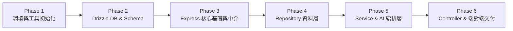

# ⚙️ 02 - 後端開發規範 (TypeScript, Express & Drizzle ORM)

本文件定義後端 AP Server 的開發標準、TypeScript 規範、依賴套件管理（pnpm）、Express 框架架構、Drizzle ORM 資料庫操作（防範 SQL Injection），以及後端開發的分階段執行計劃（Implementation Roadmap）。

---

## 1. 開發環境與套件管理 (pnpm & Express)

- **Node.js**：`>= 20.10.0 LTS`
- **套件管理器**：強制使用 **pnpm**（禁絕使用 `npm` 或 `yarn` 產生衝突的 lockfile）。
  - 安裝依賴：`pnpm install`
  - 新增套件：`pnpm add <package>`（生產環境）或 `pnpm add -D <package>`（開發環境）
  - 執行腳本：`pnpm dev` / `pnpm build` / `pnpm test` / `pnpm db:generate`
  - 鎖定檔規範：`pnpm-lock.yaml` **必須** 納入 Git 版本控制，禁止手動修改。

### 1.1 核心依賴套件清單

| 套件類別 | 套件名稱 | 說明 |
| :--- | :--- | :--- |
| **Web 框架** | `express` | 後端 HTTP API 伺服器核心框架 |
| **型別定義** | `@types/express`, `@types/node`, `@types/cors` | 嚴格 TypeScript 型別支援 |
| **資料庫 & ORM** | `drizzle-orm`, `mysql2` | Type-Safe ORM 與高效能 MySQL 驅動 |
| **ORM 工具 (Dev)** | `drizzle-kit` | 資料庫 Schema 產生、遷移與檢查工具 |
| **安全性與工具** | `helmet`, `cors`, `dotenv` | HTTP 安全標頭、跨域設定、環境變數載入 |
| **驗證函式庫** | `zod` | 請求參數 Schema 驗證與型別推導 |
| **認證模組** | `better-auth` | 身分驗證與 Session 管理 |
| **開發執行 (Dev)** | `tsx`, `vitest` | TypeScript 熱重載開發伺服器與測試框架 |

### 1.2 TypeScript 編譯配置 (`tsconfig.json`)

後端專案必須啟用最嚴格的型別檢查：

```json
{
  "compilerOptions": {
    "target": "ES2022",
    "module": "NodeNext",
    "moduleResolution": "NodeNext",
    "lib": ["ES2022"],
    "outDir": "./dist",
    "rootDir": "./src",
    "strict": true,
    "noImplicitAny": true,
    "strictNullChecks": true,
    "strictFunctionTypes": true,
    "noImplicitThis": true,
    "alwaysStrict": true,
    "noUnusedLocals": true,
    "noUnusedParameters": true,
    "noImplicitReturns": true,
    "noFallthroughCasesInSwitch": true,
    "esModuleInterop": true,
    "skipLibCheck": true,
    "forceConsistentCasingInFileNames": true
  },
  "include": ["src/**/*"],
  "exclude": ["node_modules", "dist", "tests"]
}
```

---

## 2. 後端目錄結構規範 (Directory Layout)

```
backend/
├── src/
│   ├── config/              # 環境變數載入與驗證 (DB, GCP, Better Auth, Port)
│   │   └── env.ts
│   ├── db/                  # Drizzle ORM 資料庫實例與 Schema 定義
│   │   ├── index.ts         # 資料庫連線池與 Drizzle Client 匯出
│   │   └── schema/          # 資料表綱要 (Drizzle Table Schemas)
│   │       ├── users.ts
│   │       ├── insurance.ts
│   │       ├── user-insurance.ts
│   │       ├── claim-requirements.ts
│   │       └── index.ts     # Schema 統一匯出
│   ├── routes/              # Express 路由模組層 (註冊 URL Path 與 Controller)
│   │   ├── assistant.routes.ts
│   │   ├── policy.routes.ts
│   │   ├── claim.routes.ts
│   │   ├── health.routes.ts
│   │   └── index.ts         # 主 API 路由匯總 (/api/v1)
│   ├── controllers/         # API 控制器 (負責 HTTP 請求解析與回應封裝)
│   │   ├── assistant.controller.ts
│   │   ├── policy.controller.ts
│   │   └── claim.controller.ts
│   ├── services/            # 商業邏輯層 (純 TypeScript 類別，無 HTTP 物件)
│   │   ├── user-policy.service.ts
│   │   ├── claim.service.ts
│   │   └── assistant.service.ts
│   ├── repositories/        # 資料存取層 (Drizzle ORM 查詢封裝，防止 SQL 注入)
│   │   ├── user-insurance.repository.ts
│   │   └── claim-requirement.repository.ts
│   ├── ai/                  # AI 意圖識別器與 Prompt 整合
│   │   ├── intent-classifier.ts
│   │   └── intent-router.ts
│   ├── templates/           # 回應模板 (Response & Action Templates)
│   │   ├── policy.template.ts
│   │   └── claim.template.ts
│   ├── middlewares/         # Express 中介軟體
│   │   ├── auth.middleware.ts       # Better Auth 身分認證與上下文注入
│   │   ├── validate.middleware.ts   # Zod 請求驗證中介
│   │   ├── error.middleware.ts      # 全域錯誤攔截中介
│   │   └── logging.middleware.ts    # 請求記錄中介
│   ├── models/              # DTO 與領域型別定義
│   │   └── dtos/
│   ├── utils/               # 工具函式 (Logger, AppError, ApiResponse)
│   │   ├── app-error.ts
│   │   ├── api-response.ts
│   │   └── logger.ts
│   ├── app.ts               # Express 應用實例配置 (中介層與路由掛載)
│   └── index.ts             # 伺服器啟動入口 (監聽 PORT 與優雅關機)
├── tests/                   # 單元測試與整合測試
├── drizzle.config.ts        # Drizzle Kit 配置檔 (Schema 與 DB 連線設定)
├── Dockerfile               # 多階段建置 Docker 檔
├── package.json             # 專案依賴與腳本
├── pnpm-lock.yaml           # pnpm 依賴鎖定檔
└── tsconfig.json            # TypeScript 編譯配置
```

---

## 3. Express 核心基礎設施規範

### 3.1 Express 應用配置 (`src/app.ts`)

```typescript
// src/app.ts
import express, { Application } from 'express';
import cors from 'cors';
import helmet from 'helmet';
import { apiRouter } from './routes/index.js';
import { errorHandler } from './middlewares/error.middleware.js';
import { requestLogger } from './middlewares/logging.middleware.js';

export function createApp(): Application {
  const app = express();

  // 1. 全域安全與通用中介軟體
  app.use(helmet());
  app.use(cors({
    origin: process.env.CORS_ORIGIN || '*',
    credentials: true,
  }));
  app.use(express.json({ limit: '1mb' }));
  app.use(express.urlencoded({ extended: true }));
  app.use(requestLogger);

  // 2. 註冊主要 API 路由
  app.use('/api/v1', apiRouter);

  // 3. 全域未匹配路由處理 (404)
  app.use((req, res) => {
    res.status(404).json({
      success: false,
      error: { code: 'NOT_FOUND', message: `路徑 ${req.originalUrl} 不存在` },
      meta: { timestamp: Date.now() }
    });
  });

  // 4. 全域錯誤攔截中介層 (必須掛載於所有路由之後)
  app.use(errorHandler);

  return app;
}
```

### 3.2 伺服器入口與優雅關機 (`src/index.ts`)

```typescript
// src/index.ts
import { createApp } from './app.js';
import { pool } from './db/index.js';

const PORT = parseInt(process.env.PORT || '8080', 10);
const app = createApp();

const server = app.listen(PORT, () => {
  console.log(`🚀 [Backend] AP Server is running on port ${PORT}`);
});

// 優雅關機 (Graceful Shutdown) 處理
const shutdown = async (signal: string) => {
  console.log(`\n🛑 收到 ${signal} 訊號，正在啟動優雅關閉流程...`);
  server.close(async () => {
    console.log('🔒 HTTP 伺服器連線已關閉');
    try {
      await pool.end();
      console.log('🗄️ MySQL 資料庫連線池已完全關閉');
      process.exit(0);
    } catch (err) {
      console.error('❌ 關閉資料庫連線時發生錯誤:', err);
      process.exit(1);
    }
  });

  // 超過 10 秒強制中止
  setTimeout(() => {
    console.error('⚠️ 強制關閉程序 (逾時 10s)');
    process.exit(1);
  }, 10000);
};

process.on('SIGTERM', () => shutdown('SIGTERM'));
process.on('SIGINT', () => shutdown('SIGINT'));
```

### 3.3 Zod 請求驗證中介軟體 (`src/middlewares/validate.middleware.ts`)

```typescript
// src/middlewares/validate.middleware.ts
import { Request, Response, NextFunction } from 'express';
import { AnyZodObject, ZodError } from 'zod';
import { AppError } from '../utils/app-error.js';

export const validateRequest = (schema: AnyZodObject) => {
  return async (req: Request, res: Response, next: NextFunction): Promise<void> => {
    try {
      const parsed = await schema.parseAsync({
        body: req.body,
        query: req.query,
        params: req.params,
      });
      req.body = parsed.body ?? req.body;
      req.query = parsed.query ?? req.query;
      req.params = parsed.params ?? req.params;
      next();
    } catch (error) {
      if (error instanceof ZodError) {
        const details = error.errors.map((e) => ({
          field: e.path.join('.'),
          issue: e.message,
        }));
        next(new AppError('請求參數驗證失敗', 400, 'VALIDATION_FAILED', details));
      } else {
        next(error);
      }
    }
  };
};
```

---

## 4. 三層式架構實作範例

以下展示「查詢使用者保單」在 Repository、Service、Controller 與 Express Route 的標準實作模式：

### 4.1 Repository Layer 實作 (Drizzle ORM & 防範 SQL Injection)

資料存取層強制採用 **Drizzle ORM** 進行資料庫操作，作為防禦 SQL Injection（SQL 注入攻擊）的核心屏障：

#### 4.1.1 SQL Injection 防禦準則
1. **強制使用 Type-Safe Query Builder**：
   - 所有的查詢與異動一律使用 Drizzle ORM 的查詢建構方法（如 `.select()`, `.where()`, `eq()`, `and()`, `inArray()`）。
   - Drizzle 在底層會自動將查詢參數編譯為 MySQL Prepared Statements（預編譯語句與 `?` 佔位符），**完全杜絕 SQL Injection**。
2. **嚴禁字串拼接 SQL**：
   - 嚴格禁止以 JavaScript 樣板字串（`` `${input}` ``）或字串相加組裝 SQL 語句。
3. **原生 SQL 片段使用限制 (`sql` Tagged Template)**：
   - 若遇到極特殊複雜運算必須撰寫原生 SQL 片段，**必須** 使用 Drizzle 的 `sql` tagged template literal（例如 `sql`WHERE status = ${status}``），Drizzle 會自動將嵌入變數抽出為參數化佔位符，嚴禁將未過濾字串作為原始代碼拼接。

#### 4.1.2 Drizzle Schema 定義範例

```typescript
// src/db/schema/insurance.ts
import { mysqlTable, varchar, text, timestamp } from 'drizzle-orm/mysql-core';

export const insurance = mysqlTable('insurance', {
  id: varchar('id', { length: 50 }).primaryKey(),
  code: varchar('code', { length: 50 }).notNull().unique(),
  name: varchar('name', { length: 100 }).notNull(),
  type: varchar('type', { length: 50 }).notNull(),
  description: text('description'),
  createdAt: timestamp('created_at').defaultNow().notNull(),
  updatedAt: timestamp('updated_at').defaultNow().onUpdateNow().notNull(),
});

// src/db/schema/user-insurance.ts
import { mysqlTable, char, varchar, date, timestamp, index } from 'drizzle-orm/mysql-core';
import { insurance } from './insurance.js';

export const userInsurance = mysqlTable('user_insurance', {
  id: char('id', { length: 36 }).primaryKey(),
  userId: char('user_id', { length: 36 }).notNull(),
  insuranceId: varchar('insurance_id', { length: 50 }).notNull().references(() => insurance.id),
  policyNumber: varchar('policy_number', { length: 100 }).notNull().unique(),
  status: varchar('status', { length: 20 }).default('ACTIVE').notNull(),
  startDate: date('start_date', { mode: 'string' }).notNull(),
  endDate: date('end_date', { mode: 'string' }).notNull(),
  createdAt: timestamp('created_at').defaultNow().notNull(),
  updatedAt: timestamp('updated_at').defaultNow().onUpdateNow().notNull(),
}, (table) => [
  index('idx_user_insurance_user_status').on(table.userId, table.status)
]);
```

#### 4.1.3 Repository 實作範例

```typescript
// src/repositories/user-insurance.repository.ts
import { eq, and, desc } from 'drizzle-orm';
import { MySql2Database } from 'drizzle-orm/mysql2';
import * as schema from '../db/schema/index.js';
import { userInsurance, insurance } from '../db/schema/index.js';

export type UserInsuranceDetail = {
  id: string;
  userId: string;
  insuranceId: string;
  policyNumber: string;
  status: string;
  startDate: string;
  endDate: string;
  insuranceName: string;
  insuranceType: string;
};

export interface IUserInsuranceRepository {
  findActiveByUserId(userId: string): Promise<UserInsuranceDetail[]>;
}

export class UserInsuranceRepository implements IUserInsuranceRepository {
  constructor(private readonly db: MySql2Database<typeof schema>) {}

  async findActiveByUserId(userId: string): Promise<UserInsuranceDetail[]> {
    // 透過 Drizzle ORM Query Builder 進行查詢：編譯期型別保證，執行期自動參數化，徹底防範 SQL Injection
    return await this.db
      .select({
        id: userInsurance.id,
        userId: userInsurance.userId,
        insuranceId: userInsurance.insuranceId,
        policyNumber: userInsurance.policyNumber,
        status: userInsurance.status,
        startDate: userInsurance.startDate,
        endDate: userInsurance.endDate,
        insuranceName: insurance.name,
        insuranceType: insurance.type,
      })
      .from(userInsurance)
      .innerJoin(insurance, eq(userInsurance.insuranceId, insurance.id))
      .where(
        and(
          eq(userInsurance.userId, userId),
          eq(userInsurance.status, 'ACTIVE')
        )
      )
      .orderBy(desc(userInsurance.startDate));
  }
}
```

### 4.2 Service Layer 實作
不接觸 HTTP 物件，專注商業邏輯與模板組合：

```typescript
// src/services/user-policy.service.ts
import { IUserInsuranceRepository } from '../repositories/user-insurance.repository.js';
import { PolicyTemplate } from '../templates/policy.template.js';
import { PolicyResponseDTO } from '../models/dtos/policy.dto.js';

export class UserPolicyService {
  constructor(private readonly policyRepo: IUserInsuranceRepository) {}

  async getUserPolicies(userId: string): Promise<PolicyResponseDTO> {
    const rawPolicies = await this.policyRepo.findActiveByUserId(userId);
    
    // 商業邏輯運算或過濾
    const policies = rawPolicies.map((p) => ({
      id: p.policyNumber,
      name: p.insuranceName,
      status: p.status,
      type: p.insuranceType
    }));

    // 調用模板引擎產生友善對話回覆
    const formattedContent = PolicyTemplate.formatList(policies);

    return {
      type: 'text',
      intent: 'list_user_policies',
      content: formattedContent,
      data: {
        totalPolicies: policies.length,
        policies
      }
    };
  }
}
```

### 4.3 Controller Layer 實作 (Express)
解析請求、驗證參數、調用 Service、回傳標準 JSON：

```typescript
// src/controllers/policy.controller.ts
import { Request, Response, NextFunction } from 'express';
import { UserPolicyService } from '../services/user-policy.service.js';
import { ApiResponse } from '../utils/api-response.js';
import { AppError } from '../utils/app-error.js';

export class PolicyController {
  constructor(private readonly policyService: UserPolicyService) {}

  getPolicies = async (req: Request, res: Response, next: NextFunction): Promise<void> => {
    try {
      const userId = req.user?.id; // 來自 Better Auth Middleware 注入
      if (!userId) {
        throw new AppError('尚未登入或認證無效', 401, 'UNAUTHORIZED');
      }

      const result = await this.policyService.getUserPolicies(userId);
      res.status(200).json(ApiResponse.success(result));
    } catch (error) {
      next(error); // 導流至 Express 全域錯誤處理中介層
    }
  };
}
```

### 4.4 Express 路由層掛載範例 (`src/routes/policy.routes.ts`)

```typescript
// src/routes/policy.routes.ts
import { Router } from 'express';
import { PolicyController } from '../controllers/policy.controller.js';
import { UserPolicyService } from '../services/user-policy.service.js';
import { UserInsuranceRepository } from '../repositories/user-insurance.repository.js';
import { db } from '../db/index.js';
import { requireAuth } from '../middlewares/auth.middleware.js';

const router = Router();

// 依賴注入 (DI) 初始化
const policyRepo = new UserInsuranceRepository(db);
const policyService = new UserPolicyService(policyRepo);
const policyController = new PolicyController(policyService);

// 路由綁定 (套用 Better Auth 認證中介層)
router.get('/policies', requireAuth, policyController.getPolicies);

export { router as policyRouter };
```

---

## 5. API 設計與回應規範 (API Standards)

### 5.1 統一 JSON 回應外殼 (Envelope Format)

所有 Express API 回傳均需透過 `ApiResponse` 工具格式化：

#### 成功回應 (HTTP 200 / 201)
```json
{
  "success": true,
  "data": {
    "type": "text",
    "intent": "list_user_policies",
    "content": "您目前共有 2 張有效保單...",
    "data": { ... }
  },
  "meta": {
    "timestamp": 1727700000000,
    "requestId": "req-9b1deb4d-3b7d-4bad-9bdd-2b0d7b3dcb6d"
  }
}
```

#### 失敗回應 (HTTP 4xx / 5xx)
```json
{
  "success": false,
  "error": {
    "code": "VALIDATION_FAILED",
    "message": "請求參數不正確",
    "details": [
      { "field": "message", "issue": "Message cannot be empty" }
    ]
  },
  "meta": {
    "timestamp": 1727700000000,
    "requestId": "req-9b1deb4d-3b7d-4bad-9bdd-2b0d7b3dcb6d"
  }
}
```

### 5.2 錯誤處理規範 (Error Handling)

```typescript
// src/utils/app-error.ts
export class AppError extends Error {
  constructor(
    message: string,
    public readonly statusCode: number = 500,
    public readonly errorCode: string = 'INTERNAL_ERROR',
    public readonly details?: unknown
  ) {
    super(message);
    this.name = 'AppError';
    Error.captureStackTrace(this, this.constructor);
  }
}

// src/middlewares/error.middleware.ts
import { Request, Response, NextFunction } from 'express';
import { AppError } from '../utils/app-error.js';

export const errorHandler = (
  err: Error,
  req: Request,
  res: Response,
  _next: NextFunction
): void => {
  const isAppError = err instanceof AppError;
  const statusCode = isAppError ? err.statusCode : 500;
  const errorCode = isAppError ? err.errorCode : 'INTERNAL_SERVER_ERROR';
  const message = isAppError ? err.message : '伺服器內部錯誤，請稍後再試';

  // 結構化錯誤記錄
  console.error(`[Error] ${req.method} ${req.originalUrl}:`, {
    errorCode,
    message: err.message,
    stack: process.env.NODE_ENV !== 'production' ? err.stack : undefined,
  });

  res.status(statusCode).json({
    success: false,
    error: {
      code: errorCode,
      message,
      ...(isAppError && err.details ? { details: err.details } : {})
    },
    meta: {
      timestamp: Date.now()
    }
  });
};
```

---

## 6. 後端開發分階段執行計劃 (Implementation Roadmap)

本專案後端開發規劃分為 **6 個階段 (Phases)**，採取由底而上（Bottom-Up: Database ➔ Core ➔ Repo ➔ Service ➔ API ➔ Deployment）的漸進式實作策略：



### 階段 1：環境與工具鏈初始化 (Environment & Toolchain Setup)
- **目標**：建立 `backend/` 的 pnpm workspace 專案，設定 TypeScript 與開發環境腳本。
- **工作項目**：
  1. 建立 `backend/package.json`，配置專案元資料與 scripts (`dev`, `build`, `test`, `db:generate`)。
  2. 安裝核心依賴：`express`, `cors`, `helmet`, `zod`, `dotenv`, `drizzle-orm`, `mysql2`。
  3. 安裝開發依賴：`typescript`, `@types/express`, `@types/cors`, `@types/node`, `drizzle-kit`, `tsx`, `vitest`。
  4. 建立 `tsconfig.json`（啟用嚴格模式 `strict: true`, `NodeNext`）。
  5. 建立 `.env.example` 與 `src/config/env.ts`（以 Zod 解析驗證環境變數）。
- **驗收標準**：執行 `pnpm build` 與 `pnpm dev` 能無錯誤啟動基本測試 script。

### 階段 2：資料庫綱要與 Drizzle ORM 建置 (Database & Drizzle Schema)
- **目標**：完成 MySQL 資料庫綱要對應之 Drizzle Schema 與連線池設定。
- **工作項目**：
  1. 配置 `drizzle.config.ts`。
  2. 撰寫 Drizzle Table Schemas：
     - `src/db/schema/users.ts`
     - `src/db/schema/insurance.ts`
     - `src/db/schema/user-insurance.ts`
     - `src/db/schema/claim-requirements.ts`
  3. 建立 `src/db/index.ts`（初始化 MySQL2 Connection Pool 與 Drizzle ORM Client 實例）。
  4. 整合根目錄 `db/ddl/` 初始腳本，執行連線驗證。
- **驗收標準**：成功透過 Drizzle 執行 `SELECT 1` 連線探測，Schema 與 MySQL 表結構欄位 100% 對齊。

### 階段 3：Express 核心架構與通用中介軟體 (Express Core & Middlewares)
- **目標**：搭建具備安全性、請求驗證與全域錯誤捕獲的 Express 伺服器基礎骨幹。
- **工作項目**：
  1. 實作 `src/utils/app-error.ts` 與 `src/utils/api-response.ts`（統一 JSON Envelope）。
  2. 實作 `src/middlewares/error.middleware.ts`（全域例外捕獲與環境遮蔽）。
  3. 實作 `src/middlewares/validate.middleware.ts`（Zod Schema 驗證）。
  4. 整合 Better Auth 中介層 `src/middlewares/auth.middleware.ts`。
  5. 實作健康檢查端點 `GET /healthz`（含資料庫連線檢測）。
  6. 實作 `src/app.ts` 與 `src/index.ts`（掛載中介軟體與優雅關機）。
- **驗收標準**：啟動 AP Server，打 `GET /healthz` 回傳 200，打非法路由正確回傳標準 404 JSON。

### 階段 4：Repository 資料存取層 (Data Access Layer)
- **目標**：實作防範 SQL 注入的強型別資料存取層。
- **工作項目**：
  1. 實作 `UserInsuranceRepository`：
     - `findActiveByUserId(userId: string)`：查詢使用者持有之有效保單（含險種名稱、類型關聯）。
  2. 實作 `ClaimRequirementRepository`：
     - `findByInsuranceAndType(insuranceId: string, claimType: string)`：查詢理賠所需文件規則。
  3. 撰寫 Repository 單元/整合測試（使用 Memory DB 或測試用 MySQL）。
- **驗收標準**：Repository 查詢皆使用 Drizzle Query Builder，無字串拼接，單元測試通過。

### 階段 5：商業邏輯層與 AI 意圖編排 (Services & AI Orchestration)
- **目標**：實現符合業務需求的純商業邏輯與對話回應模板。
- **工作項目**：
  1. 實作 `UserPolicyService`：處理保單資料格式轉換與統計。
  2. 實作 `ClaimService`：處理理賠資格判定、必備文件清單組裝與申請前置引導。
  3. 實作 `PolicyTemplate` 與 `ClaimTemplate`（輸出符合前端介面卡片的 Markdown 與 Action 結構）。
  4. 實作 `ai/intent-router.ts`：串接 Gemini/LLM 意圖識別器，將意圖導流至對應 Service。
- **驗收標準**：Service 隔離 HTTP 物件，業務規則具備高覆蓋率之單元測試。

### 階段 6：Express 路由整合、端對端驗收與容器化 (API Delivery & Docker)
- **目標**：依照 `spec/APIDesign/v1.md` 交付所有 API 端點，完成 Docker 鏡像建置。
- **工作項目**：
  1. 實作 Controllers：
     - `AssistantController` (`POST /assistant/message`)
     - `PolicyController` (`GET /policies`)
     - `ClaimController` (`GET /claims/requirements`, `POST /claims/start`)
  2. 掛載 Express 路由至 `src/routes/`。
  3. 整合端對端測試（E2E Testing）：驗證三大多回合智慧助理核心流程（保單查詢、理賠文件、導引理賠）。
  4. 撰寫多階段 `Dockerfile`（建置期 pnpm fetch/install/build，運行期最小化 Node.js Alpine 容器）。
- **驗收標準**：端對端 API 流程正確回傳統一 Envelope JSON，Docker 映像檔順利構建並通過健康檢查。
